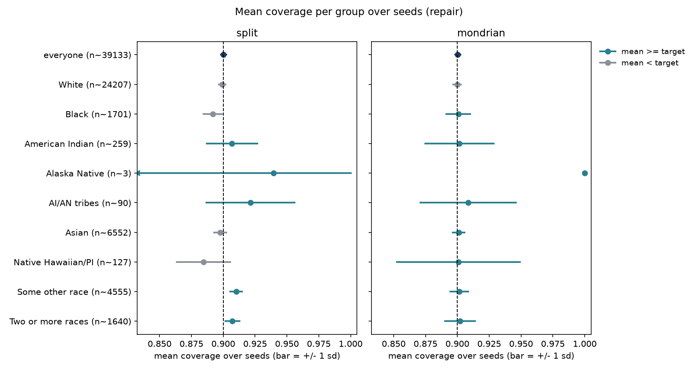
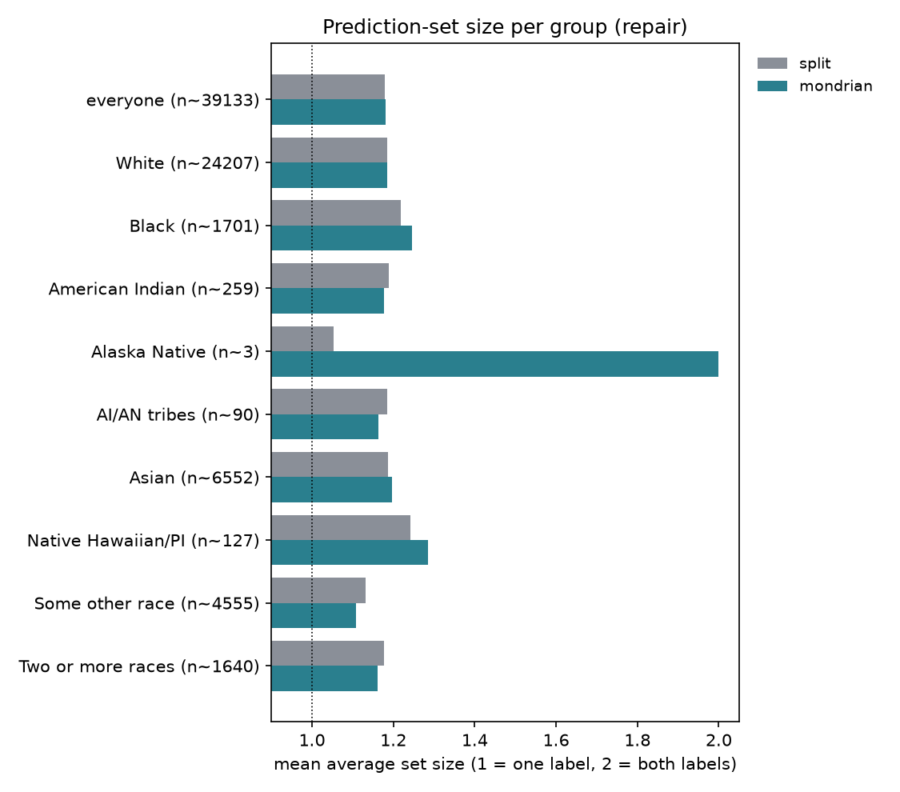
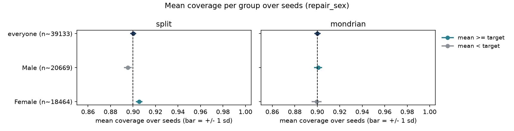
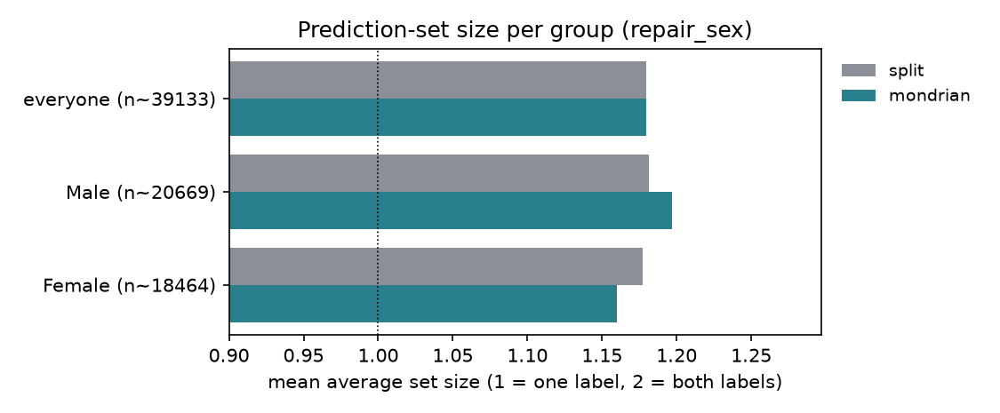
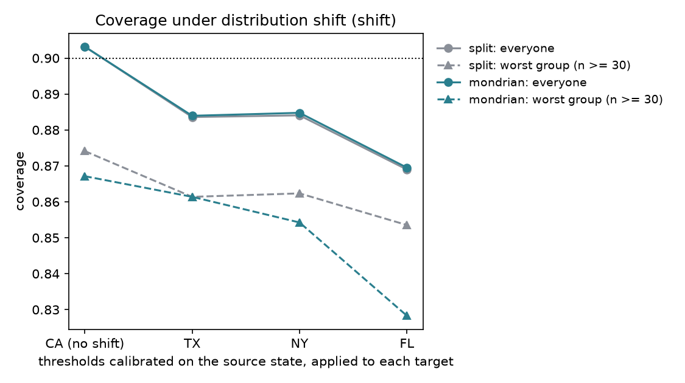

# covaudit report

Generated by covaudit 0.4.0 from `results` (alpha = 0.1).

## Single-seed audits

_None found._

## Repair experiment: split vs Mondrian over seeds

### `repair/group_coverage.csv`

Summary over seeds:

| method | n_seeds | coverage_mean | coverage_std | worst_gap_mean | worst_gap_std | set_size_mean | set_size_std | seeds_with_fail |
|---|---|---|---|---|---|---|---|---|
| split | 20 | 0.9002 | 0.0021 | 0.0635 | 0.0964 | 1.1795 | 0.0038 | 10 |
| mondrian | 20 | 0.9003 | 0.0021 | 0.0296 | 0.0252 | 1.1803 | 0.0038 | 9 |

Per-group means over seeds:

| group | name | n | coverage split | set size split | coverage mondrian | set size mondrian |
|---|---|---|---|---|---|---|
| ALL | everyone | 39133 | 0.9002 | 1.1795 | 0.9003 | 1.1803 |
| 1 | White | 24207 | 0.8991 | 1.1839 | 0.8997 | 1.1857 |
| 2 | Black | 1701 | 0.8917 | 1.2181 | 0.9007 | 1.2458 |
| 3 | American Indian | 259 | 0.9069 | 1.1889 | 0.9016 | 1.1777 |
| 4 | Alaska Native | 3 | 0.9396 | 1.0530 | 1.0000 | 2.0000 |
| 5 | AI/AN tribes | 90 | 0.9213 | 1.1849 | 0.9084 | 1.1629 |
| 6 | Asian | 6552 | 0.8974 | 1.1860 | 0.9010 | 1.1963 |
| 7 | Native Hawaiian/PI | 127 | 0.8846 | 1.2428 | 0.9008 | 1.2852 |
| 8 | Some other race | 4555 | 0.9101 | 1.1313 | 0.9014 | 1.1083 |
| 9 | Two or more races | 1640 | 0.9072 | 1.1766 | 0.9020 | 1.1615 |

### `repair_sex/group_coverage.csv`

Summary over seeds:

| method | n_seeds | coverage_mean | coverage_std | worst_gap_mean | worst_gap_std | set_size_mean | set_size_std | seeds_with_fail |
|---|---|---|---|---|---|---|---|---|
| split | 20 | 0.9002 | 0.0021 | 0.0046 | 0.0028 | 1.1795 | 0.0038 | 12 |
| mondrian | 20 | 0.9002 | 0.0023 | 0.0023 | 0.0020 | 1.1794 | 0.0042 | 4 |

Per-group means over seeds:

| group | name | n | coverage split | set size split | coverage mondrian | set size mondrian |
|---|---|---|---|---|---|---|
| ALL | everyone | 39133 | 0.9002 | 1.1795 | 0.9002 | 1.1794 |
| 1 | Male | 20669 | 0.8954 | 1.1817 | 0.9008 | 1.1969 |
| 2 | Female | 18464 | 0.9056 | 1.1771 | 0.8995 | 1.1599 |

## Distribution shift: thresholds from one state used in others

### `shift/shift_coverage.csv`

Per target and method:

| target | shifted | method | n | coverage | avg_set_size | worst_group_gap | fail_groups |
|---|---|---|---|---|---|---|---|
| CA | False | split | 39133 | 0.9032 | 1.1818 | 0.0259 | 1 |
| CA | False | mondrian | 39133 | 0.9032 | 1.1824 | 0.0329 | 0 |
| TX | True | split | 135924 | 0.8836 | 1.2024 | 0.0386 | 3 |
| TX | True | mondrian | 135924 | 0.8839 | 1.2036 | 0.0386 | 2 |
| NY | True | split | 103021 | 0.8841 | 1.1984 | 0.0377 | 2 |
| NY | True | mondrian | 103021 | 0.8848 | 1.2004 | 0.0457 | 3 |
| FL | True | split | 98925 | 0.8690 | 1.2118 | 0.0465 | 4 |
| FL | True | mondrian | 98925 | 0.8695 | 1.2135 | 0.0717 | 4 |

Coverage per group:

| group | name | CA split | CA mondrian | TX split | TX mondrian | NY split | NY mondrian | FL split | FL mondrian |
|---|---|---|---|---|---|---|---|---|---|
| ALL | everyone | 0.9032 | 0.9032 | 0.8836 | 0.8839 | 0.8841 | 0.8848 | 0.8690 | 0.8695 |
| 1 | White | 0.9020 | 0.9012 | 0.8804 | 0.8799 | 0.8824 | 0.8819 | 0.8629 | 0.8622 |
| 2 | Black | 0.8852 | 0.8934 | 0.8865 | 0.8961 | 0.8734 | 0.8822 | 0.8963 | 0.9057 |
| 3 | American Indian | 0.9004 | 0.9004 | 0.8779 | 0.8721 | 0.8623 | 0.8543 | 0.8535 | 0.8283 |
| 4 | Alaska Native | 1.0000 | 1.0000 | 1.0000 | 1.0000 | 1.0000 | 1.0000 | 1.0000 | 1.0000 |
| 5 | AI/AN tribes | 0.9326 | 0.8876 | 0.9134 | 0.8773 | 0.9208 | 0.9208 | 0.9821 | 0.9464 |
| 6 | Asian | 0.8997 | 0.9030 | 0.8916 | 0.8941 | 0.8982 | 0.9008 | 0.8744 | 0.8785 |
| 7 | Native Hawaiian/PI | 0.8741 | 0.8671 | 0.8614 | 0.8614 | 0.8684 | 0.8684 | 0.9459 | 0.9459 |
| 8 | Some other race | 0.9162 | 0.9136 | 0.9129 | 0.9104 | 0.9021 | 0.8997 | 0.9089 | 0.9045 |
| 9 | Two or more races | 0.9191 | 0.9179 | 0.8967 | 0.8950 | 0.8909 | 0.8901 | 0.8854 | 0.8850 |

